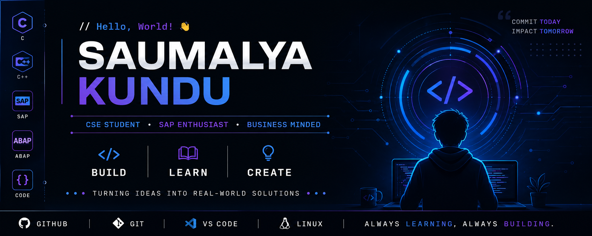

  

# ⚡ Hello, World! I'm Saumalya Kundu

<h3 align="center">💻 Computer Science & Engineering Student | 🤖 SAP & Business Management Enthusiast</h3>

  <i>Learning. Building. Experimenting. Turning ideas into real-world solutions.</i>

  

---

## 🚀 About Me

I'm a Computer Science & Engineering student who enjoys exploring technology, business, and building things that solve real problems.

- 🔭 Currently exploring **SAP & Business Management**
- 💻 Learning **Software Development & Programming**
- 🚀 Working on **Projects & Hackathons**
- 🌱 Always learning something new
- ⚡ Interested in turning ideas into practical solutions

## 🛠️ Tech Stack

### 💻 Programming Languages

  

### 🏢 SAP & Development

  
  

### ⚙️ Tools & Technologies

  

---

## 🔭 Currently Exploring

- 🏢 **SAP & Business Management**
- 💻 **Software Development**
- 🧩 **Problem Solving & DSA**
- 🏆 **Hackathons & Team Projects**

---

## 🏆 Hackathons & Events

🚀 **Hackathon Projects**  
Currently exploring ideas, building prototypes, and working on team-based projects.

> More projects and achievements coming soon...

## 🔥 GitHub Activity

  

